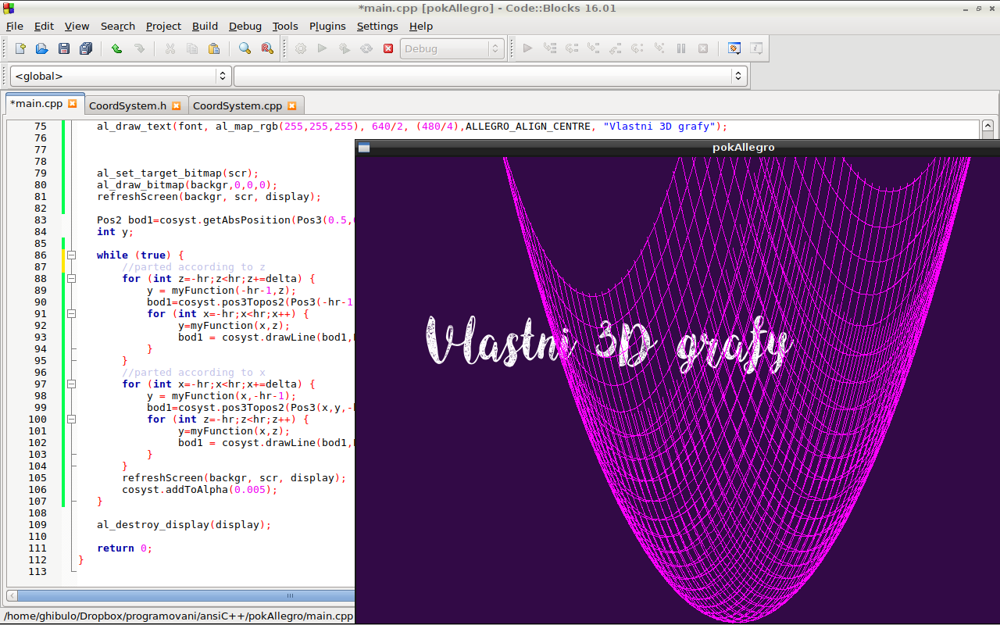
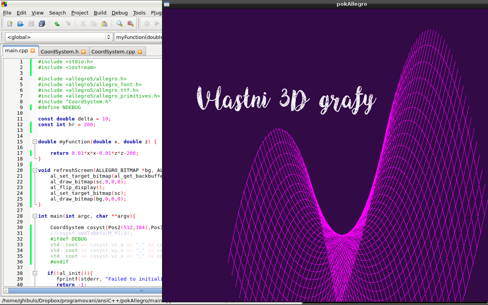

# Moje vlastní 3D grafy

Zatím jen základ...

- structura Pos3 - pro E3 vektory, body, možnost zadávat kartezsky/polárně
- třída CoordSystem - udržuje informace o systému souřadnic (střed, osové vektory), zajišťuje metody pro rotaci a posun soustavy souřadnic, vykresluje spojnici dvou E3 bodů
- main - inicializuje allegro, v nekonečném cyklu kreslí do bufferu rotující graf pomocí parciálních funkcí a refrešuje obrazovku 

TODO:
- přidělat osy, natáčení a scalování pomocí myši
- možnost uživatelsky vkládat funkční předpis 

Ukázkové screenshoty:

